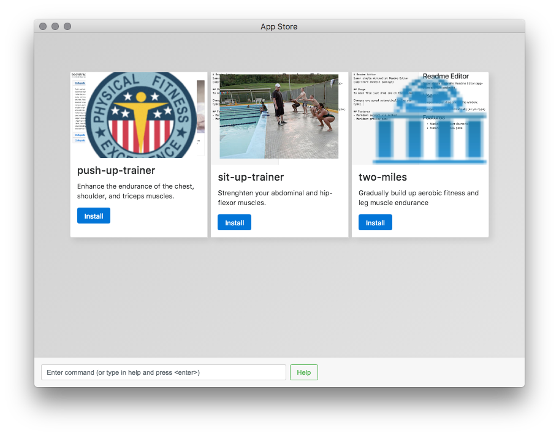

# physical-fitness
Open source app store for nerds and bodybuilders.

physical-fitness is a cross-platform (Windows, Mac, and Linux) app-store with tools for improving and maintaining fitness levels. It contains applications that help with creating workout plans, motivation and dietary habits.

## Roadmap, Categories, and Ideas
- Apps for Generating Ideas
- Tools for Collecting writing entries
- Apps for voting/choosing a seed idea
- Tools for planning drafts
- Apps to help track revisions to content and quality
- Tools that help improve grammar
- Tools that help with publishing
